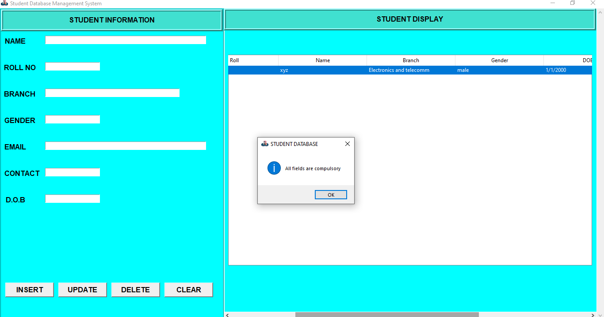

# Student database management system. 🧑‍💻
> Welcome viewers 🙂

This project is basically a student management system and can be used to Store , update , read , or delete students records. All these operations are performed by backend code
in connection with a database. The frontend code provides an awesome  'graphical user interface' to access the students records and to manage them without bothering about other technicalities.
#### Languages and Tools used 🔧 :
- Python.
- sqlite.
- pycharm.
- sqlite browser.

## Output 💻



## Installing 💾 

#### Install python according to your operating system.
[Python Download](https://www.python.org/downloads/)
#### You can use any IDE (I personally use Pycharm for this project.)
[Pycharm download](https://www.jetbrains.com/pycharm/download/#section=windows)
#### Install sqlite browser according to your operating system.
[sqlite browser download](https://sqlitebrowser.org/dl/)
#### Install git according to your operating system.
[Git download](https://git-scm.com/downloads)

## Getting started 😄 📑
- First install all the essentials mentioned above.
- Open your git bash terminal and copy paste below code.
  ```

- Now open those files in your favourite IDE.
- Now you have create a database with the same name as mentioned in backend code i.e 'studentrecord'.
  - You an add below code to backend.py file to create a database.
    ```
    # Connecting to sqlite
    conn = sqlite3.connect('studentrecord.db')
    # Creating a cursor object using the cursor() method
    cursor = conn.cursor()
    # Creating table as per requirement
    sql ='''CREATE TABLE studentrecord(
      id	INTEGER,
	  PRIMARY KEY(id),
      StdID text,
      Name text,
      Branch text,
      Gender text,
      DoB text,
      Mobile text,
      Email text
    )'''
    # Creating table as per requirement
    cursor.execute(sql)
    print("Table created successfully........")
    # Commit your changes in the database
    conn.commit()
    # Closing the connection
    conn.close()
    ```
  - Or you can create database with name 'studentrecord' directly from sqlite browser. [Refer](https://youtu.be/YLOZpYAYPLQ)
- Note keep all the files in same folder.
- Also download the logo given in repo and keep in same folder.
  ```
  root.iconbitmap(r'logo.ico')
  ```
  - Here you need that logo in fronend.py file.
  - If you want your own logo then store that in same folder and just change name of file in above code.


